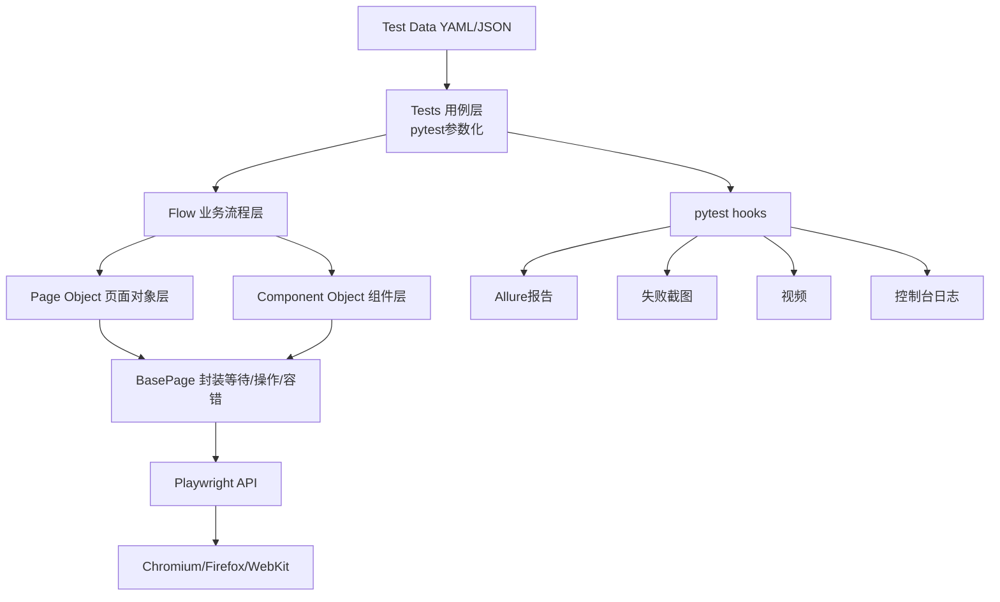

# WebUI自动化框架落地需求文档（Pytest + Playwright）

## 1. 文档目标与范围

本需求文档用于指导搭建一套面向 **PC Web 单环境** 的 UI 自动化测试框架，核心目标：

- 基于 **POM（Page Object Model）** 分层设计。
- 采用 **Pytest + Playwright** 作为执行引擎。
- 使用 **数据驱动（参数化输入）** 提升复用能力。
- 支持 **失败截图、视频、控制台日志** 采集与 **Allure 报告** 展示。
- 通过工程化约束实现 **稳定性** 与 **可维护性**。
- 提供 **目录模板与代码生成脚手架**，降低新增页面/用例成本。

> 说明：本方案不包含关键字驱动、多环境隔离、CI/CD流水线示例与在线报告托管。

---

## 2. 需求基线（已确认）

### 2.1 业务与运行边界

1. 测试对象：仅 **PC Web**。  
2. 环境数量：仅 **单环境**。  
3. Python 版本：不强制指定。  
4. 允许使用辅助库（如重试、配置管理、数据处理等）。

### 2.2 框架设计要求

1. 分层：
   - Page Object 层
   - 业务流程层（Flow/Service）
   - 用例层（Test Case）
2. 公共区域需独立为 **Component Object**（如导航栏、弹窗、上传组件）。
3. 不采用关键字驱动。
4. 数据驱动仅用于参数化输入，不做环境维度数据隔离。

### 2.3 报告与工件要求

1. 必须支持：
   - 失败截图
   - 视频
   - 控制台日志
2. 失败截图命名：`用例名 + 时间戳`。
3. 报告使用 Allure，需可在浏览器本地打开。

### 2.4 稳定性与维护性要求

1. 需针对以下场景提供专项设计：
   - 弹窗
   - 加载慢
   - iframe
   - 上传文件
2. 自动重试：失败最多重试 **3 次**。
3. 不要求内置 lint/format/type-check。
4. 需要提供目录模板与代码生成脚手架。
5. 需求文档需包含：架构图、目录规范、编码规范、示例骨架、里程碑计划。

---

## 3. 技术选型与版本建议

### 3.1 核心依赖

- `pytest`：测试组织与执行。
- `playwright`：浏览器自动化能力。
- `pytest-playwright`（可选）：简化浏览器 fixture 管理。
- `allure-pytest`：报告集成。

### 3.2 推荐配套依赖

- `pytest-rerunfailures`：失败重跑（最多3次）。
- `pyyaml`：测试数据与配置文件读取。
- `python-dotenv`（可选）：本地敏感配置加载。
- `loguru` 或 `logging`：日志标准化。

---

## 4. 分层架构设计

## 4.1 分层职责

### A. Page Object 层
- 仅封装页面元素定位与原子行为（点击、输入、读取、等待）。
- 不承载复杂业务判断。

### B. Component Object 层
- 将可复用组件抽离（顶部导航、弹窗、日期控件、上传控件）。
- 可被多个页面对象组合使用。

### C. 业务流程层（Flow）
- 聚合多个页面/组件动作，形成端到端业务流（如登录流、提交流）。
- 对测试层暴露“可读业务动作”，隐藏底层实现细节。

### D. 用例层（Tests）
- 以业务视角编排用例与断言。
- 使用 `pytest.mark.parametrize` 对输入做数据驱动。

### E. 基础设施层（Support）
- Browser/Context/Page fixture。
- Hook：失败截图、日志收集、Allure附件。
- 工具：重试、等待策略、路径管理、数据加载。

## 4.2 架构图（分层 + 数据流）



---

## 5. 目录结构规范（模板）

```text
project_root/
├── requirements.txt
├── pytest.ini
├── conftest.py
├── run.py                             # 统一执行入口（可选）
├── framework/
│   ├── core/
│   │   ├── base_page.py               # 封装click/fill/wait/screenshot
│   │   ├── locator.py                 # 可选：定位器常量/构造
│   │   └── retry.py                   # 可选：业务级重试工具
│   ├── pages/
│   │   ├── login_page.py
│   │   └── home_page.py
│   ├── components/
│   │   ├── modal_component.py
│   │   ├── upload_component.py
│   │   └── header_component.py
│   ├── flows/
│   │   ├── auth_flow.py
│   │   └── order_flow.py
│   ├── data/
│   │   ├── login_data.yaml
│   │   └── order_data.yaml
│   ├── fixtures/
│   │   ├── browser_fixtures.py
│   │   └── data_fixtures.py
│   ├── utils/
│   │   ├── data_loader.py
│   │   ├── time_util.py
│   │   └── logger.py
│   └── scripts/
│       ├── scaffold.py                # 脚手架入口
│       └── templates/
│           ├── page.py.j2
│           ├── flow.py.j2
│           └── test_case.py.j2
├── tests/
│   ├── test_login.py
│   └── test_order.py
├── reports/
│   ├── allure-results/
│   └── allure-report/
├── artifacts/
│   ├── screenshots/
│   ├── videos/
│   └── console/
└── README.md
```

---

## 6. 编码规范（可维护性）

### 6.1 Page/Component 编码约束

1. 一个类对应一个页面或组件，命名示例：`LoginPage`、`UploadComponent`。
2. 定位器使用语义化命名，如 `username_input`、`submit_button`。
3. 页面动作函数返回 `self` 或下一个页面对象，支持链式调用。
4. 禁止在页面对象中写业务断言（断言应在测试层或Flow返回结果后做）。

### 6.2 Flow 层规范

1. Flow 方法应体现业务语义，如 `login_as(user)`。
2. 一个 Flow 方法完成一个闭环业务动作。
3. Flow 层可做必要的业务前置校验，但避免深度耦合UI细节。

### 6.3 用例层规范

1. 用例命名：`test_模块_场景_预期`。
2. 使用参数化驱动输入数据。
3. `Arrange-Act-Assert` 三段清晰。
4. 失败信息应包含关键上下文（账号、订单号、页面状态等）。

---

## 7. 数据驱动方案

### 7.1 数据组织

- 推荐 YAML（可读性高，便于业务同学协作）。
- 每个业务模块一个数据文件。
- 数据仅含输入参数，不做多环境分层。

**示例：`login_data.yaml`**

```yaml
valid_cases:
  - case_id: login_ok_01
    username: user_a
    password: pass_a
  - case_id: login_ok_02
    username: user_b
    password: pass_b

invalid_cases:
  - case_id: login_fail_01
    username: wrong
    password: wrong
```

### 7.2 参数化模式

- 在测试层读取并转换为 `pytest.mark.parametrize` 参数。
- 参数ID建议直接使用 `case_id`，便于报告检索。

---

## 8. 稳定性设计（专项）

### 8.1 弹窗

- 提供统一弹窗组件 `ModalComponent`。
- 操作前先探测是否出现阻塞弹窗。
- 弹窗处理逻辑集中封装，避免测试层散落 `if`。

### 8.2 加载慢

- 采用显式等待（元素可见/可点击/网络空闲）替代固定 `sleep`。
- `BasePage` 封装通用等待方法：`wait_visible`、`wait_clickable`。
- 对关键接口可配合 `wait_for_response`。

### 8.3 iframe

- 统一通过 `frame_locator` 入口访问。
- Page层封装 `get_frame(name|selector)`，禁止测试层直接硬编码 frame 选择。

### 8.4 上传文件

- 将上传动作沉淀在 `UploadComponent.upload(file_path)`。
- 兼容两种模式：
  - `set_input_files`
  - 监听文件选择器事件 `expect_file_chooser`
- 文件路径统一由工具层生成绝对路径，避免相对路径漂移。

### 8.5 自动重试

- 使用 `pytest-rerunfailures`，失败重跑 `3` 次。
- 重试仅用于降低偶发抖动，不掩盖稳定复现缺陷。

---

## 9. 失败截图、视频、控制台日志、Allure集成

### 9.1 失败截图

- 触发时机：`pytest_runtest_makereport` 中 `call.failed`。
- 存储目录：`artifacts/screenshots/`。
- 文件名规范：`{test_name}_{YYYYmmdd_HHMMSS}.png`。
- 同步作为 Allure 附件写入报告。

### 9.2 视频

- Context 配置 `record_video_dir=artifacts/videos/`。
- 用例结束后保留视频并写入 Allure 附件（以链接或文件附件方式）。

### 9.3 控制台日志

- 在 Page 初始化时监听 `page.on("console", handler)`。
- 按测试用例维度写入 `artifacts/console/{test_name}.log`。
- 用例结束统一附加到 Allure。

### 9.4 Allure 报告本地打开

```bash
# 生成结果
pytest --alluredir=reports/allure-results

# 生成静态报告
allure generate reports/allure-results -o reports/allure-report --clean

# 浏览器打开
allure open reports/allure-report
```

---

## 10. 脚手架需求（目录模板 + 代码生成）

### 10.1 脚手架能力目标

`framework/scripts/scaffold.py` 支持：

1. 生成 Page 类模板：
   - `python scaffold.py page Login`
2. 生成 Component 类模板：
   - `python scaffold.py component Upload`
3. 生成 Flow 类模板：
   - `python scaffold.py flow Auth`
4. 生成测试用例模板：
   - `python scaffold.py test login`

### 10.2 模板字段

- 类名、文件名、作者、创建时间。
- 预置常用方法结构（init、locators、actions）。
- 用例模板预置参数化与基础断言结构。

### 10.3 生成策略

- 若文件存在默认拒绝覆盖（需 `--force` 才覆盖）。
- 自动校验命名合法性并提示修复建议。

---

## 11. 示例代码骨架（最小可运行）

### 11.1 `base_page.py`（示意）

```python
class BasePage:
    def __init__(self, page):
        self.page = page

    def click(self, locator: str, timeout: int = 10000):
        self.page.locator(locator).click(timeout=timeout)

    def fill(self, locator: str, value: str, timeout: int = 10000):
        self.page.locator(locator).fill(value, timeout=timeout)

    def wait_visible(self, locator: str, timeout: int = 10000):
        self.page.locator(locator).wait_for(state="visible", timeout=timeout)

    def screenshot(self, path: str):
        self.page.screenshot(path=path, full_page=True)
```

### 11.2 `login_page.py`（示意）

```python
from framework.core.base_page import BasePage


class LoginPage(BasePage):
    username_input = "#username"
    password_input = "#password"
    submit_button = "button[type='submit']"

    def login(self, username: str, password: str):
        self.fill(self.username_input, username)
        self.fill(self.password_input, password)
        self.click(self.submit_button)
```

### 11.3 `auth_flow.py`（示意）

```python
from framework.pages.login_page import LoginPage


class AuthFlow:
    def __init__(self, page):
        self.login_page = LoginPage(page)

    def login_as(self, username: str, password: str):
        self.login_page.login(username, password)
```

### 11.4 `test_login.py`（示意）

```python
import pytest
from framework.flows.auth_flow import AuthFlow


@pytest.mark.parametrize(
    "username,password",
    [
        ("user_a", "pass_a"),
        ("user_b", "pass_b"),
    ],
)
def test_login_success(page, username, password):
    flow = AuthFlow(page)
    flow.login_as(username, password)
    assert page.url.endswith("/home")
```

---

## 12. 非功能要求（NFR）

1. 执行稳定性：
   - 相同版本代码在同环境重复执行，结果波动可控。
2. 可读性：
   - 新成员可在1天内理解分层与新增用例方式。
3. 可扩展性：
   - 新增页面/流程无需改动基础架构。
4. 可追溯性：
   - 失败可通过截图、视频、日志定位问题。

---

## 13. 里程碑落地计划

### M1：框架骨架搭建（1~2天）
- 初始化目录结构。
- 接入 pytest + playwright + allure。
- 完成基础 fixture 与 `BasePage`。

### M2：可观测能力接入（1天）
- 失败截图命名实现。
- 视频与控制台日志采集。
- Allure 附件串联。

### M3：分层样板实现（1~2天）
- 实现至少1套页面 + 组件 + flow + 用例样板。
- 覆盖弹窗/慢加载/iframe/上传专项能力。

### M4：数据驱动与重试（1天）
- YAML 数据加载。
- 参数化用例改造。
- 重试策略（3次）落地。

### M5：脚手架与文档完善（1天）
- 完成 `scaffold.py` 与模板文件。
- 输出使用手册与开发规范。

### M6：试运行与验收（1天）
- 执行冒烟集。
- 生成并浏览器打开 Allure 报告。
- 缺陷与优化项回收。

---

## 14. 验收标准

1. 可执行：`pytest` 能稳定跑通样例用例。
2. 可观测：失败用例必有截图（符合命名规则）、视频、控制台日志。
3. 可报告：可成功生成并打开 Allure 报告。
4. 可维护：新增一个页面对象 + 一个流程 + 一个参数化用例，开发过程顺畅。
5. 可扩展：脚手架可生成模板并直接用于开发。

---

## 15. 风险与规避

1. 选择器脆弱导致误报：
   - 优先语义化/稳定属性定位，避免绝对路径。
2. 慢加载导致偶发失败：
   - 强制显式等待策略，禁用无意义 `sleep`。
3. 用例与页面耦合过深：
   - 以Flow隔离业务变化，测试层只做编排与断言。
4. 工件过多占磁盘：
   - 按任务批次清理历史 artifacts。

---

## 16. 结论

该方案已完整覆盖你的约束条件：

- POM + Component + Flow + Test 四层协作；
- 数据驱动仅参数化输入；
- 失败截图（用例名+时间戳）、视频、控制台日志、Allure浏览器查看；
- 针对弹窗、慢加载、iframe、上传文件的稳定性专项；
- 自动重试3次；
- 提供目录模板与脚手架能力；
- 包含架构图、目录规范、编码规范、代码骨架与里程碑计划。

可直接作为实施蓝图进入开发阶段。
